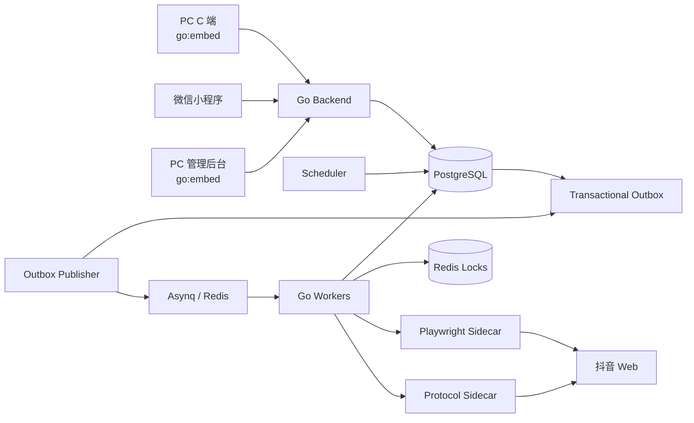

# 抖音火花助手 — 设计文档索引

> 工作名：Douyin Keeper Next。本文档集用于从零重开项目，优先稳定产品边界与核心领域模型，再进入编码。

## 目标

面向普通用户提供一个多账号抖音火花维护工具：用户可以绑定自己的抖音账号、同步好友、选择需要维护的好友、配置每日互动任务，并在 PC 与微信小程序查看状态和操作；运营方通过 PC 管理后台管理用户、账号、任务、风控、Worker 与站点配置。

系统不把“浏览器自动化细节”暴露给业务层。抖音登录、好友同步、会话查询、消息发送统一通过 Adapter/Capability 层实现。

## 文档

1. `01-product-scope.md` — 产品定位、角色、MVP 与版本边界
2. `02-ux-ia.md` — PC C 端、小程序、PC 管理后台的信息架构与页面设计
3. `03-domain-data.md` — 核心领域模型、数据关系、状态机与关键唯一约束
4. `04-backend-architecture.md` — 后端服务、队列、Worker、Sidecar 与部署架构
5. `05-douyin-integration.md` — 抖音登录态、多账号隔离、好友/会话/发送 Adapter 设计
6. `06-api-jobs.md` — API 分组、长任务协议、调度与幂等设计
7. `07-security-observability.md` — Session 安全、权限、审计、日志、指标与故障处理
8. `08-roadmap-repo.md` — 推荐技术栈、Monorepo 结构、里程碑与开发顺序
9. `09-database-schema.md` — PostgreSQL 表、索引、唯一约束、Session Envelope 与迁移顺序
10. `10-sidecar-protocol.md` — Go ↔ Playwright/Protocol Sidecar NDJSON 协议 v1
11. `11-openapi-contract.md` — PC、小程序、Admin 的公开 API Contract v1
12. `12-card-code-entitlement.md` — 无支付系统下的卡密、权益授权、续期与到期控制
13. `13-auth-entitlement-engineering.md` — PC/小程序 Auth、Refresh Session、Link Code、权益 Gate 与配额工程实现
14. `14-go-backend-package-design.md` — Go 单 Module、多 cmd、领域 Package、Repository/Tx/Outbox 边界
15. `15-scheduler-worker-state-machine.md` — Scheduler、Transactional Outbox、SendIntent/SendJob、Lease/Retry/Lock 状态机
16. `16-deployment-packaging.md` — PC 前端 go:embed、Backend/Worker 镜像与 Docker Compose 生产部署

## 总体架构

## 核心原则

- **账号是强隔离边界**：Session、好友、会话、任务、发送记录、风控状态均以 `account_id` 为核心作用域。
- **好友使用稳定平台 ID 标识**：昵称与备注只用于展示，不能作为发送路由主键。
- **发送任务先建 Intent，再执行 Job**：调度与执行双重幂等，避免重复续火花。
- **Adapter 能力化**：业务层只关心 `Login / SyncFriends / SendMessage`，不关心 XPath、Webpack、Cookie 字段。
- **协议发送是可选能力**：协议失效时降级，不影响账号本身的登录状态。
- **不做风控规避对抗**：遇到验证码、安全验证、限流等直接暂停并要求用户处理。
- **授权与支付解耦**：系统不接支付/订单，卡密只负责生成 `EntitlementGrant`，配额和能力从当前权益推导。
- **数据库是真相、队列是传输**：所有跨 DB/Queue 的任务创建使用 Transactional Outbox，Redis/Asynq 不承担业务状态源。
- **Auth 与 Entitlement 分离**：登录只证明用户身份，是否允许平台动作必须单独经过权益、配额、资源归属、Session、Capability、Risk Gate。
- **PC 前端随 Backend 发布**：Web C 端与 Admin 构建产物通过 `go:embed` 编译进 Go Backend；小程序独立发布。
- **Compose 是标准生产交付单元**：Backend、Scheduler/Worker、PostgreSQL、Redis 通过 `deploy/compose/docker-compose.yml` 统一编排；业务 Worker Pool 可多进程但复用同一 Worker 镜像。

## 可直接进入仓库的契约草案

- `schema-v1.sql` — PostgreSQL 初版 DDL 草案
- `sidecar-protocol-v1.schema.json` — Sidecar Envelope JSON Schema
- `openapi-v1.yaml` — OpenAPI 3.1 初版机器可读契约

建议正式开仓后分别移动到 `db/migrations/`、`packages/contracts/sidecar/`、`packages/contracts/openapi.yaml`，并由 CI 做 lint / contract test。
