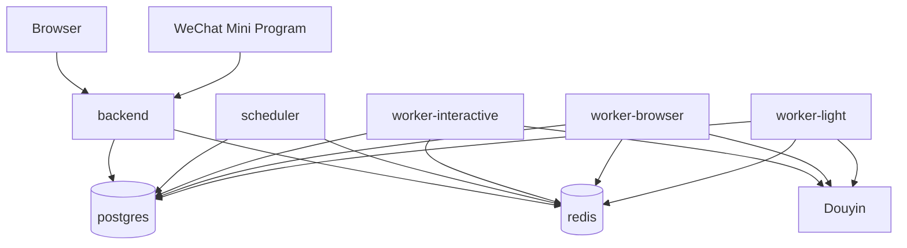

# 前端嵌入与 Docker Compose 部署设计

> 本文冻结 Douyin Keeper Next 的生产发布形态。PC C 端与 PC Admin 不作为独立 Web 服务部署，而是在构建阶段生成静态文件并通过 `go:embed` 编译进 Backend 二进制。微信小程序独立发布。Backend、Scheduler/Worker、PostgreSQL、Redis 使用一个 Docker Compose 项目统一编排。

## 1. 发布单元

生产环境只维护两类业务镜像：

```text
keeper-backend
keeper-worker
```

以及两个基础设施镜像：

```text
postgres
redis
```

其中：

- `keeper-backend`：Go API + PC C 端静态资源 + PC Admin 静态资源；
- `keeper-worker`：Go Scheduler/Worker + Playwright Sidecar；Protocol Sidecar 启用时也随 Worker 镜像发布；
- PostgreSQL：业务状态真相；
- Redis：Asynq transport、delay queue、Account Lock 等临时协调状态。

Backend 暴露业务 HTTP 端口与 `/metrics` 抓取端点；Scheduler/Worker 使用
`METRICS_ADDR`（默认 `:9090`）提供仅供 Compose 内部网络访问的指标端口，生产环境不应
将该端口映射到公网。

不同 Worker Pool 仍然保持进程隔离，但复用同一个 `keeper-worker` 镜像：

```text
scheduler
worker-interactive
worker-browser
worker-light
```

这样既保留资源隔离，又避免维护四套镜像。

## 2. PC 前端嵌入 Backend

### 2.1 范围

嵌入：

- `apps/web`：统一 PC App（普通用户路由与 `/admin/*` 管理路由）。

不嵌入：

- `apps/mini`：微信小程序，由微信开发者工具/CI 构建并上传微信平台。

### 2.2 构建流程

```text
pnpm build:spa
      ↓
apps/web/dist
      ↓ Docker build stage copy
backend/internal/transport/webassets/dist/web
      ↓
go build
      ↓
keeper-backend
```

本地开发使用 Vite 提供 SPA，`apps/web/vite.config.ts` 将 dev/preview 服务固定绑定到
IPv4 loopback（`127.0.0.1`），与 README 中的访问地址一致；生产运行不依赖该服务，仍只
从 Backend 的 `go:embed` 静态文件系统提供页面。开发代理保留原始 Host，不改写浏览器
Origin 对应的主机名，使 HttpOnly Cookie 的刷新/退出同源校验与生产单体部署一致。

生产构建使用 TanStack Router 自动路由拆包，并对 React、Router、Query、UI、表单和图标
依赖生成带 hash 的共享 vendor chunk；统一 SPA 发布边界保持不变，但用户只在进入对应
路由时加载该页面 chunk。

最终运行容器不需要 Node.js，也不需要 Nginx 才能提供 PC 页面。

### 2.3 Go 嵌入包

建议：

```text
backend/internal/transport/webassets/
├─ webassets.go
├─ fallback/
│  └─ index.html
└─ dist/
   ├─ .gitkeep
   └─ web/
```

仓库保留一个 `fallback/index.html` 和 `dist/.gitkeep`，保证 fresh checkout 可以执行 Go
编译和基础启动检查；fallback 不是生产前端。发布构建必须先运行 `pnpm build:spa`，该命令
只重建 `dist/web` 并写入带 hash 的统一 Web/Admin SPA 资源，Docker backend 构建阶段也会
重新生成并覆盖该目录。

`webassets.go`：

```go
package webassets

import "embed"

//go:embed dist/web/*
var FS embed.FS
```

实际实现需要支持嵌套静态目录；可使用 `//go:embed dist/web` 并通过 `fs.Sub` 得到统一 SPA 文件系统。

### 2.4 HTTP 路由

正式路由约定：

```text
/api/v1/*        -> Go API
/jobs/*/events   -> Go SSE（实际仍建议位于 /api/v1）
/admin            -> Unified SPA 的 Admin index fallback
/admin/*          -> Unified SPA 的 Admin route/static assets
/*                -> Unified SPA 的用户 route/static assets
```

当前实现统一为：

```text
/api/v1/*        API
/admin/*         Unified SPA Admin routes
/*               Unified SPA user routes
```

路由匹配顺序必须是：

```text
API/SSE
  ↓
Admin static + SPA fallback
  ↓
Web static + SPA fallback
```

否则 Web SPA fallback 可能吞掉 API 404。

### 2.5 SPA fallback

对于：

```text
/account/xxx
/friends
/admin/users/xxx
```

如果静态文件不存在：

- `/admin/*` 返回 Admin `index.html`；
- 其他非 `/api/*` 路径返回 Web `index.html`；
- `/api/*` 永远返回真实 HTTP 404/业务错误，禁止 fallback 到 HTML。

### 2.6 Cache Policy

推荐：

```text
index.html
Cache-Control: no-cache

/assets/<hash>.*
Cache-Control: public, max-age=31536000, immutable

/api/*
Cache-Control: no-store（按接口具体语义调整）
```

前端构建必须启用内容 hash，避免 Backend 升级后旧静态资源缓存冲突。

## 3. Backend 镜像

Backend 镜像推荐 Multi-stage Build：

```text
Node build stage
  -> build web/admin

Go build stage
  -> copy frontend dist
  -> build api + migrate binary

runtime stage
  -> only Go binaries + CA cert + timezone data
```

建议输出：

```text
/app/backend
/app/migrate
```

生产容器以非 root 用户运行。

Backend 不包含：

- Python Playwright runtime；
- Chromium；
- Protocol SDK runtime；
- Redis/PostgreSQL 客户端工具（除非运维确有需要）。

## 4. Worker 镜像

Worker 镜像承担平台自动化运行时，因此与 Backend 镜像分离。

包含：

```text
/app/scheduler
/app/worker-interactive
/app/worker-browser
/app/worker-light
/opt/keeper/sidecars/playwright
/opt/keeper/sidecars/protocol   # 可选
```

并安装：

- Playwright Python runtime；
- Chromium 及必要系统库；
- Node runtime（仅 Protocol Adapter 启用时需要）。

Worker 镜像不包含 PC 前端资源。

所有 Worker 可以使用同一镜像，只改变 `command`。

## 5. Compose 服务拓扑



其中 Scheduler 同时运行：

- SparkTask Tick；
- Transactional Outbox Publisher；
- Retry due scan；
- Lease Reaper；
- 必要的周期性 capability/risk housekeeping。

## 6. Docker Compose 文件

标准文件名使用：

```text
docker-compose.yml
```

也可以使用新版 Compose 推荐的：

```text
compose.yml
```

本项目文档统一使用：

```text
deploy/compose/docker-compose.yml
```

Docker Compose 使用 YAML，不使用 XML。

示例文件见：

`deploy/compose/docker-compose.yml`

提交前可运行 `pnpm deployment:check` 验证生产/开发 Compose 都能被 Docker Compose 解析，
生产服务拓扑与端口暴露符合本文约定，两个 `.env.example` 模板保持同步，并且 Backend/Worker
Dockerfile 仍包含统一 SPA 嵌入与 Playwright Sidecar 运行时。该检查只在临时目录生成测试用的
`.env`，不会修改仓库根目录或提交真实 Secret。

## 7. Compose 服务

正式建议：

```text
postgres
redis
migrate
backend
scheduler
worker-interactive
worker-browser
worker-light
```

`migrate` 是一次性初始化服务，复用 Backend 镜像，并非额外长期运行组件。

启动依赖：

```text
postgres healthy
redis healthy
      ↓
migrate completed successfully
      ↓
backend / scheduler / workers
```

### 7.1 为什么不让每个进程自动跑 Migration

多个副本同时启动时可能产生 migration race。推荐由 Compose 中的一次性 `migrate` 服务统一执行。

如果未来迁移到 Kubernetes，则替换为 Job/InitContainer。

## 8. 数据持久化

至少：

```text
postgres-data
redis-data
```

PostgreSQL 必须持久化。

Redis 虽然不是业务真相，但保存 Asynq 待执行/延迟任务，因此生产环境建议启用 AOF 并持久化：

```text
appendonly yes
appendfsync everysec
```

即使 Redis 数据丢失，Transactional Outbox/Reconciler 仍应能够恢复尚未完成的业务任务，但不应把这种恢复能力当作不持久化 Redis 的理由。

## 9. 配置与 Secret

仓库根目录只提交：

```text
.env.example
```

`deploy/.env.example` 仅作为部署目录旁的导航副本，必须与根目录模板保持键和值同步；实际部署
仍只复制根目录 `.env.example` 为根目录 `.env`。

自部署时复制为根目录 `.env`，并通过 `docker compose --env-file .env -f deploy/compose/docker-compose.yml ...` 启动；这样 Compose 自身的变量插值和容器 `env_file` 使用同一份配置。

禁止提交：

```text
.env
```

Compose 运行时通过环境变量/secret 注入：

```text
DATABASE_URL
REDIS_ADDR
TRUSTED_PROXY_CIDRS
AUTH_SIGNING_KEY
SESSION_MASTER_KEY
CARD_CODE_PEPPER_DK1
WECHAT_APP_ID
WECHAT_APP_SECRET
WECHAT_NOTIFICATION_TEMPLATE_ID
WECHAT_NOTIFICATION_PAGE
WECHAT_NOTIFICATION_TITLE_FIELD
WECHAT_NOTIFICATION_BODY_FIELD
```

生产环境建议进一步使用 Docker Secrets、Portainer/平台 Secret 或外部 Secret Manager。

Backend 与 Worker 可共享数据库/Redis连接信息，但 Sidecar 子进程本身不获得数据库主密码、Redis密码、Session Master Key。

`TRUSTED_PROXY_CIDRS` 是逗号分隔的直接反向代理 peer IP/CIDR，例如
`10.0.0.2/32,10.0.0.0/24`。只有来自这些 peer 的 `X-Forwarded-Proto` 和
`X-Forwarded-For` 才会被使用；留空表示客户端直连，应用只使用 TLS 和 socket peer。
反向代理必须覆盖（不能追加）这两个 Header，且 Backend 端口不应绕过代理暴露到公网。

## 10. 网络暴露

默认只向宿主机暴露 Backend：

```text
backend: 8080
```

禁止直接暴露：

```text
postgres:5432
redis:6379
worker
scheduler
sidecar
```

Compose 使用内部 bridge network：

```text
keeper-internal
```

如果前面还有 Caddy/Nginx/Traefik，只代理 Backend 即可，因为 PC 前端已经由 Backend 提供。

## 11. 健康检查

Backend：

```text
GET /health/live
GET /health/ready
```

建议语义：

- `/health/live`：进程自身仍工作，不依赖外部组件；
- `/health/ready`：PostgreSQL/Redis 可用，且 `schema_migrations` 已应用当前二进制内嵌的最新
  migration；只 Ping 数据库但未完成迁移时仍返回 `503`，避免流量进入不完整 Schema。

Worker 不对公网开 HTTP，可通过：

- DB `worker_instances.heartbeat_at`；
- Docker process healthcheck；
- Admin Worker 页面；

判断健康状态。

## 12. 升级流程

推荐：

```text
pull/build new images
      ↓
docker compose --env-file .env -f deploy/compose/docker-compose.yml run --rm migrate
      ↓
docker compose --env-file .env -f deploy/compose/docker-compose.yml up -d
      ↓
health check
```

对于不可向后兼容的 Schema 变更，使用 Expand -> Migrate -> Contract，避免新旧 Worker 短暂并存时读取失败。

## 13. 开发环境

开发环境不强制前端嵌入：

```text
Vite Dev Server -> Go API
```

这样保留 HMR。

生产/Release 构建必须验证：

```text
apps/web/dist exists
backend/internal/transport/webassets/dist/web exists
      ↓
go:embed build
```

CI 中如果任一前端未构建成功，Backend Release 镜像不得产生。

## 14. 冻结结论

生产交付模型固定为：

```text
一个代码仓库
     ↓
Backend Image
  ├─ Go API
  ├─ Web C 端
  └─ Admin

Worker Image
  ├─ Scheduler
  ├─ Interactive Worker
  ├─ Browser Worker
  ├─ Light Worker
  └─ Sidecar Runtime

PostgreSQL
Redis
     ↓
Docker Compose 统一部署
```

微信小程序独立发布，不进入 Docker Compose。
