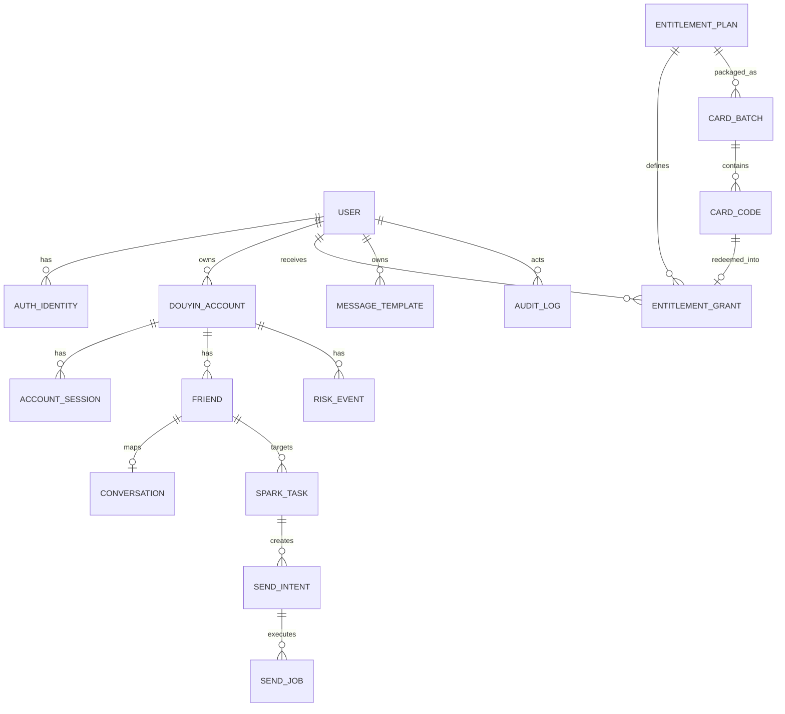

# 领域模型与数据设计

## 1. 核心实体

## 2. User

字段：

- `id`
- `public_id`
- `status`
- `role`
- `display_name`
- `created_at`
- `updated_at`

认证身份单独建表 `auth_identities`：

- `provider`: password / email / wechat_mini
- `provider_subject`
- `user_id`

避免未来把用户体系绑定死在一种登录方式上。

## 2.1 EntitlementPlan / CardBatch / CardCode / EntitlementGrant

系统内部不接支付。访问授权由四类实体组成：

- `EntitlementPlan`：定义账号槽位、任务额度、每日执行上限和 feature flags；
- `CardBatch`：把一个 Plan 包装为指定有效天数的一批卡密；
- `CardCode`：一次性兑换凭证，只保存 HMAC，不保存明文；
- `EntitlementGrant`：用户实际获得的一段授权时间。

`users` 不直接保存配额。运行时从当前 active Grant 对应的 Plan 计算 EffectiveEntitlement。

MVP 续期采用顺延规则：新 Grant 从 `max(now, last_unrevoked_grant.expires_at)` 开始，避免提前续期损失时间。Schema 支持多个 Plan，但 MVP 建议只启用一个正式方案，暂不处理跨档位升级/降级折算。

详见 `12-card-code-entitlement.md`。

## 3. DouyinAccount

字段：

- `id`
- `public_id`
- `user_id`
- `platform_user_id`
- `nickname`
- `avatar_url`
- `binding_status`
- `session_status`
- `risk_status`
- `paused_at`
- `last_session_check_at`
- `last_friend_sync_at`
- `created_at`
- `updated_at`

推荐状态：

`binding_status`: `unbound | binding | bound | released`

`session_status`: `unknown | valid | expired | challenge_required`

`risk_status`: `normal | cooling_down | paused`

唯一约束：

- `UNIQUE(user_id, platform_user_id)`（platform_user_id 非空时）

## 4. AccountSession

Session 独立出账号表，便于版本化和轮换：

- `account_id`
- `version`
- `key_version`
- `ciphertext`
- `created_at`
- `last_validated_at`

不在普通业务查询中 SELECT Session。

## 5. Friend

字段：

- `id`
- `public_id`
- `account_id`
- `platform_user_id`
- `display_name`
- `nickname`
- `short_id`
- `avatar_url`
- `streak_days`
- `has_conversation`
- `spark_enabled`
- `last_seen_at`
- `last_sent_at`

关键约束：

- `UNIQUE(account_id, platform_user_id)`

昵称、备注名绝对不能作为稳定主键。

如果平台暂时拿不到稳定用户 ID，可以先进入 `identity_pending` 状态，禁止自动发送，直到身份被解析。

## 6. Conversation

字段：

- `account_id`
- `friend_id`
- `platform_conversation_id`
- `channel`
- `last_message_at`
- `last_synced_at`

关键约束：

- `UNIQUE(account_id, platform_conversation_id)`
- `UNIQUE(account_id, friend_id, channel)`

## 7. SparkTask

一个好友一个每日火花任务：

- `id`
- `public_id`
- `user_id`
- `account_id`
- `friend_id`
- `enabled`
- `timezone`
- `window_start`
- `window_end`
- `message_kind`
- `message_body`
- `allow_first_message`
- `created_at`
- `updated_at`

约束：

- `UNIQUE(account_id, friend_id)`

MVP 不支持复杂 RRULE。

## 7.1 MessageTemplate

用户可复用的消息内容资源：

- `public_id`
- `user_id`
- `name`
- `kind`: `text | sticker`
- `body`
- `created_at`
- `updated_at`
- `deleted_at`

模板只属于创建者。任务套用模板时复制 `kind/body` 形成任务快照，不把模板更新
传播到已存在任务，避免调度中的消息内容发生隐式变化。

关键约束：

- 活跃模板在同一用户下名称唯一；
- `name` 长度 1–80，`body` 长度 1–500；
- `kind` 只允许 `text | sticker`。

## 8. SendIntent

调度层的幂等核心：

- `id`
- `task_id`
- `account_id`
- `friend_id`
- `local_date`
- `scheduled_at`
- `status`: `pending | queued | running | succeeded | failed | skipped | cancelled`
- `last_job_id`
- `created_at`
- `updated_at`

关键约束：

- `UNIQUE(task_id, local_date)`

这保证一天只产生一个业务意图。

## 9. SendJob

执行层记录：

- `id`
- `public_id`
- `intent_id`
- `account_id`
- `friend_id`
- `attempt`
- `selected_adapter`
- `status`
- `error_code`
- `platform_message_id`
- `started_at`
- `finished_at`

一个 Intent 可以产生有限次 Job（例如网络错误重试），但成功只能有一次。

## 10. RiskEvent

字段：

- `account_id`
- `category`
- `code`
- `severity`
- `source_adapter`
- `detail_json`
- `action`
- `cooldown_until`
- `created_at`

分类：

- AUTH
- PLATFORM
- PROTOCOL
- BROWSER
- NETWORK
- DATA

## 11. CapabilitySnapshot

用于展示某账号当前可以做什么：

- `account_id`
- `capability`
- `status`
- `adapter`
- `checked_at`
- `error_code`

示例：

- `message.send.text.existing`
- `message.send.sticker.existing`
- `message.send.text.first`
- `friends.sync`
- `session.validate`

业务选择 Adapter 时基于 Capability，而不是硬编码“优先 protocol”。
