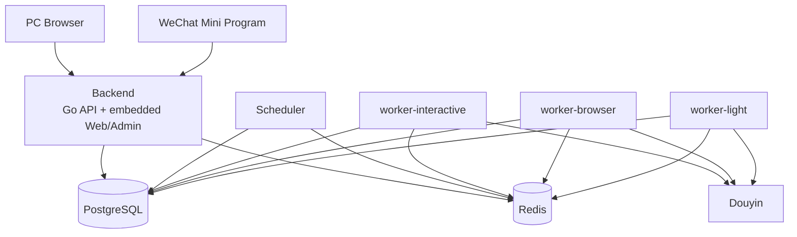

# 后端架构设计

## 1. 技术栈

推荐：

- Go 1.24+
- HTTP: chi / gin / echo 三选一，推荐 chi 保持轻量
- PostgreSQL 17+
- Redis
- Asynq
- Python + Playwright
- Node.js Protocol Sidecar（可选能力）
- OpenTelemetry

如果更熟悉 MySQL 8，可以无损替代 PostgreSQL；本设计依赖的核心只有事务、唯一约束、索引和 JSON 字段。

## 2. 服务

### API Service

负责：

- 用户认证；
- C 端 API；
- Admin API；
- 权限判断；
- EffectiveEntitlement 计算与卡密兑换；
- CRUD；
- 创建 Job/Intent；
- SSE Job Event；
- 不直接运行浏览器。

Auth 使用短生命周期 Access Token + 可撤销 Refresh Session。PC 的 Refresh Token 使用 HttpOnly Cookie，小程序使用独立 `client_type=mini` Session；小程序首次绑定通过一次性 Link Code 绑定已有 User。详细见 `13-auth-entitlement-engineering.md`。

### Scheduler / Worker

负责：

- Session Check；
- Friends Sync；
- Send Intent 生成（生成前检查 EffectiveEntitlement）；
- Send Job；
- Risk Action；
- Adapter 健康检查。

### Playwright Sidecar

职责限定：

- 登录二维码；
- SMS 交互；
- Session 验证；
- 好友同步；
- 浏览器发送；
- 必要的页面读取。

不拥有：

- 数据库凭据；
- Redis 凭据；
- 用户权限；
- 业务定时逻辑。

### Protocol Sidecar

MVP 可不启用。

职责限定：

- 协议能力探测；
- 会话解析；
- 文本发送；
- 返回平台消息 ID。

Protocol 失败只导致 capability degraded，不应直接把账号标成 expired。

Go Sidecar Client 在发送前规范化并校验 v1 request envelope，在收到响应后校验
`request_id`、`protocol_version` 及 success/failure 互斥关系；Adapter 的结构化
`error.detail` 原样保留给 fallback policy，避免把未知平台结果误判为未发送。


## 2.1 Entitlement Service

授权逻辑放在 Go API/Domain 内，不属于 Sidecar。核心接口建议：

```text
GetEffectiveEntitlement(userID)
RedeemCard(userID, code)
CheckAccountQuota(userID)
CheckTaskQuota(userID)
RequireFeature(userID, feature)
GrantEntitlement(adminID, userID, planID, period)
RevokeGrant(adminID, grantID, reason)
```

卡密兑换必须在 PostgreSQL 事务内完成，并锁定 User 与 CardCode。Scheduler/Worker 只读取授权结果，不读取或处理卡密明文。


## 2.2 Transactional Outbox

API/Scheduler 在业务事务内只写 PostgreSQL：

```text
business row + Job/Intent + queue_outbox
```

独立 Outbox Publisher 再投递 Asynq。禁止业务事务 commit 后直接做一次 Redis enqueue 作为唯一投递路径。

这保证：

- DB commit 成功但 Redis 暂时不可用时任务不会丢；
- API 手动执行、Scheduler、Retry 使用同一可靠投递模型；
- Queue duplicate 可以通过 Job CAS/Intent 状态机安全吸收。

详见 `15-scheduler-worker-state-machine.md`。

## 2.3 Embedded Web Delivery

生产 Release 中 PC C 端与 PC Admin 由单一 `apps/web` TanStack App 构建，再复制到 `backend/internal/transport/webassets/dist/web/`，由 Go `go:embed` 编译进 Backend 二进制。Admin 使用同一 bundle 下的 `/admin/*` 嵌套路由。

运行时路由固定为：

```text
/api/v1/*  -> Go API/SSE
/admin/*   -> Unified SPA 的 Admin 路由
/*         -> Unified SPA 的用户路由
```

API 路由优先于 SPA fallback。微信小程序独立发布，不进入 Backend 静态资源。详细见 `16-deployment-packaging.md`。

## 3. Worker Pool

不要用一个全局并发数同时限制登录、浏览器和轻量任务。

推荐：

### `worker-interactive`

- QR Login
- SMS Login

并发较低，任务持续时间较长。

### `worker-browser`

- Friends Sync
- Browser Send
- Session Browser Check

使用 Redis 全局 Browser Semaphore（key=`semaphore:browser`），例如
`MAX_GLOBAL_BROWSERS=3`。`WORKER_BROWSER_CONCURRENCY` 只控制单个 worker
进程的 queue concurrency，二者必须分开配置；Sidecar 调用持有带 TTL 的租约并自动续租。

### `worker-light`

- Send Dispatch
- Protocol Send
- Capability Probe
- WeChat subscription notification
- 轻量状态更新

Scheduler Tick、Retry Scan、Lease Reaper 独立为 `scheduler` 进程，不占 Worker queue concurrency。

并发较高。

`send.protocol` 已接入 `worker-light` 的真实发送 preflight：它与 Browser Send 共享账号锁、
Session 临时文件、Capability/Adapter Health、Entitlement 和 fail-closed 结果校验；真实
Protocol SDK 未部署或能力快照不可用时，任务以稳定错误结束，不会被 stub handler 直接 ACK。

## 4. Account Lock

涉及同一抖音账号的“会改变平台状态”的任务必须获取：

`lock:account:{account_id}`

典型需要锁：

- 登录；
- 发送；
- 好友同步；
- 会话归档。

当前会话归档是用户侧索引状态更新，不调用 Sidecar；平台侧归档接入后必须沿用同一账号
锁，并通过 Job/Outbox 执行，不能在 API 请求中直接调用平台。

只读数据库报表不需要锁。

锁必须包含：

- owner job id；
- acquired_at；
- heartbeat；
- TTL。

释放时使用 compare-and-delete，不能直接无条件删除。

## 5. 长任务事件

扫码登录等需要实时反馈：

```text
POST /api/accounts/bindings
  -> job_id

GET /api/jobs/{job_id}/events
  -> SSE
```

事件：

- `started`
- `qr_ready`
- `scanned`
- `confirming`
- `challenge_required`
- `success`
- `error`
- `cancelled`

事件体不允许包含 Cookie、Session、手机号明文等 Secret。

## 6. Adapter Resolver

Go 业务层调用：

```text
SendMessage(account, friend, message)
```

Resolver：

1. 读取账号 capability；
2. 根据消息类型选择 Adapter；
3. 调用；
4. 如果错误类型允许 fallback，再尝试下一 Adapter；
5. 记录实际使用的 Adapter。

示例：

```text
text + existing conversation
  protocol.im healthy -> protocol
  protocol unavailable -> browser.consumer

sticker
  browser.consumer only

first message
  creator capability only
```

Resolver 只会把路由交给已注册的可执行 Adapter；当前部署注册的是
`browser.consumer`，`protocol.im` 仍处于实验/未接线状态。Adapter fallback
还必须收到明确的 `not_sent` 证据，结果未知时保持 fail-closed。

## 7. 部署

生产环境使用一个 Docker Compose 项目统一部署：



发布只维护两类业务镜像：

```text
keeper-backend  = Go API + Web C 端 + Admin
keeper-worker   = Scheduler/Workers + Playwright/Protocol Sidecar runtime
```

`worker-interactive / worker-browser / worker-light / scheduler` 使用同一个 Worker 镜像，通过不同 `command` 启动，继续保持进程和资源池隔离。Sidecar 默认作为 Worker 容器内的受控子进程运行，不单独暴露网络服务；未来需要更强沙箱时可以再拆为独立容器。

PostgreSQL 与 Redis 不对宿主机公网暴露。Redis 启用 AOF；PostgreSQL/Redis 都使用持久化 volume。

正式 Compose 文件：`deploy/compose/docker-compose.yml`。详细见 `16-deployment-packaging.md`。

## 8. Go 工程组织

Go 后端推荐单 Module、多 `cmd` 入口：`api / scheduler / worker-interactive / worker-browser / worker-light`，共享 `internal/auth`、`entitlement`、`account`、`send` 等领域 package。详见 `14-go-backend-package-design.md`。
