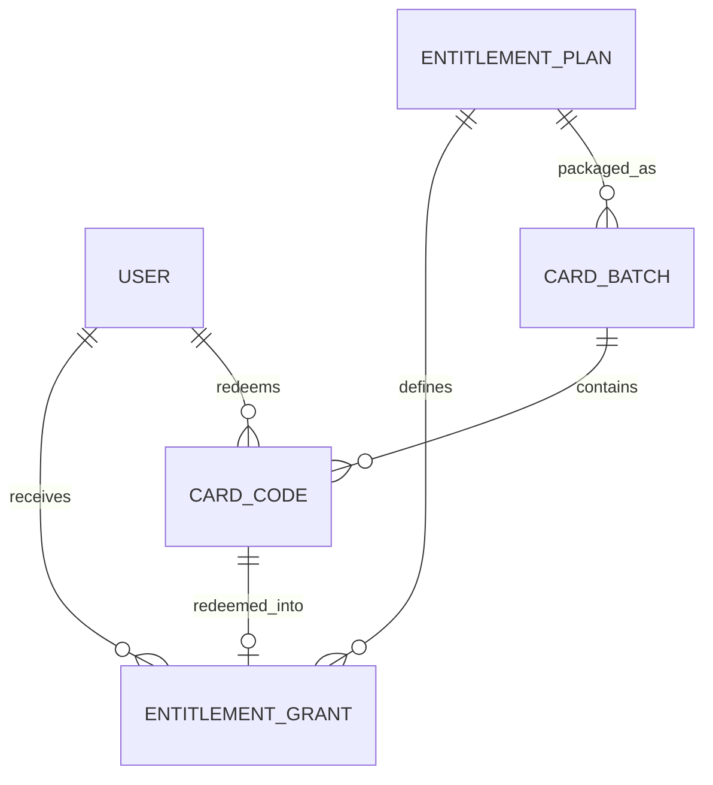

# 卡密与权益授权设计

> 本项目内部不接入支付系统。系统不维护商品价格、订单、支付单、退款、支付回调或渠道结算；只负责“卡密兑换 -> 权益授权 -> 到期控制”。卡密可由项目之外的任意渠道分发，Douyin Keeper 不感知卡密如何获得。

## 1. 设计目标

卡密模块解决四件事：

1. 管理员定义“用户获得什么能力”；
2. 管理员批量生成一次性卡密；
3. 用户在 PC 或微信小程序兑换；
4. 系统依据当前有效权益决定账号槽位、任务额度和功能开关。

它不是支付系统，也不是订单系统。

系统内部统一使用“权益（Entitlement）”术语，避免把业务模型绑定到“会员购买”“套餐订单”等商业概念。

## 2. 核心原则

### 2.1 支付与授权完全解耦

系统中不存在：

- `orders`
- `payments`
- `payment_callbacks`
- `refunds`
- `prices`
- 支付渠道 SDK
- 支付状态机

系统只存在：

```text
EntitlementPlan
      ↓
CardBatch
      ↓
CardCode
      ↓ redeem
EntitlementGrant
      ↓
EffectiveEntitlement
```

### 2.2 User 不直接保存配额

不再在 `users` 上保存 `account_quota`。

配额和能力来自当前生效的 `EntitlementGrant -> EntitlementPlan`：

```text
User
  ↓
active EntitlementGrant
  ↓
EntitlementPlan
  ├─ account_quota
  ├─ task_quota
  ├─ daily_send_quota
  └─ features
```

这样卡密续期、到期、后台赠送和未来档位扩展都不需要修改 User 主表。

### 2.3 卡密是凭证

卡密按敏感凭证处理：

- 高熵随机生成；
- 数据库不保存卡密明文；
- 后端只保存 keyed hash；
- 明文只在生成完成时展示/导出一次；
- 日志、审计、错误追踪不得记录完整卡密。

## 3. 权益方案 EntitlementPlan

权益方案只描述“用户拥有的系统权限”，不描述价格。

建议字段：

```text
id
public_id
code                # stable / standard / pro 等内部编码
name
status              # active | disabled
account_quota       # 可绑定抖音账号数
task_quota          # 可启用火花任务数
daily_send_quota    # 产品侧每日执行上限
features_json       # 功能集合
created_at
updated_at
```

`features_json` 示例：

```json
{
  "browser_text_send": true,
  "sticker_send": false,
  "protocol_sender": false,
  "creator_first_message": false
}
```

注意：平台安全策略、Adapter 健康状态仍然可以进一步收紧能力。权益只表达“产品允许”，不能绕过 `CapabilitySnapshot`、Risk、Session 状态。

最终能否执行应满足：

```text
Entitlement allows
AND Account capability available
AND Session valid
AND Risk policy allows
AND Task enabled
```

## 4. 卡密批次 CardBatch

管理员不是逐个创建卡密，而是创建批次。

一个批次固定：

- 权益方案；
- 有效时长；
- 卡密数量；
- 兑换截止时间；
- 批次状态。

建议字段：

```text
id
public_id
name
entitlement_plan_id
duration_days
quantity
status              # active | disabled
code_version        # 1 => DK1
redeem_not_before
redeem_before
created_by
note
created_at
```

停用 Plan/Batch 只阻止新的兑换和发行，不影响已经生成的 `EntitlementGrant`；已授权用户不会因为管理员停用一个方案模板而立即失去现有权益。

`duration_days` 放在批次而不是 Plan 中，因此同一个 Standard 权益方案可以生成：

- 7 天体验卡；
- 30 天卡；
- 90 天卡；
- 365 天卡。

这些都授权同一种能力，只是授权时间不同。

## 5. 卡密 CardCode

### 5.1 格式

建议 v1：

```text
DK1-XXXX-XXXX-XXXX-XXXX-XXXX-XXXX
```

其中 payload 使用 Crockford Base32，避免 `O/0`、`I/1` 等容易混淆字符。

建议至少 120 bit 随机熵。不要使用：

- 自增序号；
- 时间戳；
- 用户 ID；
- UUID 截断；
- 可预测批次号 + 短随机数。

`DK1` 是卡密格式/哈希密钥版本，不代表权益档位。生成新一代卡密时可以切换为 `DK2` 并使用新的 `CARD_CODE_PEPPER_V2`；旧 Pepper 仅保留到对应版本卡密全部兑换或过期，避免直接轮换密钥导致未兑换卡全部失效。

### 5.2 存储

服务端标准化卡密后计算：

```text
HMAC-SHA-256(CARD_CODE_PEPPER_V{code_version}, normalized_code)
```

数据库保存：

```text
code_hash
code_fingerprint
```

`各版本 `CARD_CODE_PEPPER_Vn` 使用独立密钥，不与 Session Key、JWT Key 共用。

`code_fingerprint` 仅用于后台定位和客服沟通，例如取 HMAC 的前 10 个十六进制字符；它不能用于兑换。

不保存完整卡密明文。

### 5.3 生命周期

```text
unused ──────→ redeemed
   │
   └────────→ revoked
```

已兑换卡密不做“恢复为 unused”。如果需要撤销用户权益，应撤销对应 `EntitlementGrant`，保留原兑换事实用于审计。

## 6. EntitlementGrant

每次成功兑换都会产生一条不可变的授权记录。

建议字段：

```text
id
public_id
user_id
entitlement_plan_id
source_type          # card | admin
source_card_id       # card 来源时必填
starts_at
expires_at
revoked_at
revoked_by
revoke_reason
created_at
```

有效状态不必维护复杂状态机，可由时间计算：

```text
scheduled: now < starts_at
active:    starts_at <= now < expires_at AND revoked_at IS NULL
expired:   now >= expires_at
revoked:   revoked_at IS NOT NULL
```

## 7. 续期规则

MVP 使用“顺延时间段”规则，避免复杂的升级折算。

用户兑换卡密时：

```text
anchor = max(now, 用户最后一条未撤销 Grant 的 expires_at)
starts_at = anchor
expires_at = anchor + duration_days
```

例如：

```text
当前权益：2026-08-01 ~ 2026-09-01
8 月 20 日兑换 30 天卡

新 Grant：2026-09-01 ~ 2026-10-01
```

这样提前续期不会损失剩余天数，也不存在两个 Grant 同时争夺当前权益的问题。

### 7.1 MVP 的档位限制

虽然 Schema 支持多个 EntitlementPlan，但 MVP 建议只启用一个正式方案，例如 `standard`，通过不同 `duration_days` 区分卡密。

若未来启用多个档位，MVP 阶段先禁止不同 Plan 混合排队：

```text
409 ENTITLEMENT_PLAN_CONFLICT
```

后续再单独设计升级、降级、剩余时间折算，不把商业规则提前塞进核心授权系统。

## 8. 原子兑换流程

兑换必须是一个数据库事务，并对 User + Card 加锁。

伪流程：

```text
POST /entitlements/redeem
        │
        ├─ normalize(code)
        ├─ HMAC(code)
        ↓
BEGIN
        │
        ├─ SELECT user FOR UPDATE
        ├─ SELECT card WHERE code_hash = ? FOR UPDATE
        │
        ├─ 校验 Card 状态
        ├─ 校验 Batch 状态 / 兑换时间窗
        ├─ 校验 Plan
        ├─ 计算 starts_at / expires_at
        │
        ├─ INSERT entitlement_grant
        ├─ UPDATE card -> redeemed
        ├─ INSERT audit_log
        ↓
COMMIT
```

对 User 加事务锁可防止用户同时兑换两张卡导致两个 Grant 使用同一个 `anchor`。

### 8.1 重复提交

卡密天然是单次凭证，因此不要求额外的 `Idempotency-Key`。

如果同一个用户重复提交自己刚刚兑换成功的卡密，可以返回原 Grant，作为幂等成功；如果卡密已被其他用户兑换，返回：

```text
409 CODE_ALREADY_REDEEMED
```

## 9. 权益到期行为

权益过期不删除用户数据，也不解绑抖音账号。

到期后：

允许：

- 登录；
- 查看历史记录；
- 查看已绑定账号；
- 解除绑定/删除数据；
- 兑换新卡密；
- 查看帮助与通知。

禁止：

- 绑定新的抖音账号；
- 新建/启用火花任务；
- 创建新的 SendIntent；
- 手动立即发送；
- 主动好友同步等非必要平台操作。

Scheduler 在生成 Intent 前必须检查 EffectiveEntitlement。过期时任务本身保持配置，但不继续调度。

推荐错误码：

```text
ENTITLEMENT_REQUIRED
ENTITLEMENT_EXPIRED
ACCOUNT_QUOTA_EXCEEDED
TASK_QUOTA_EXCEEDED
FEATURE_NOT_ENTITLED
```

用户续期后原任务可以恢复，不要求重新配置。

## 10. 配额检查位置

不能只在前端隐藏按钮，API/Worker 都必须检查。

### Account quota

创建 Binding Job 之前检查：

```text
bound account count < entitlement.account_quota
```

### Task quota

创建或从 disabled -> enabled 时检查：

```text
enabled task count < entitlement.task_quota
```

### Daily send quota

Scheduler 和 Manual Send 都检查；最终 Worker 执行前再次确认，防止并发穿透。

## 11. C 端页面

### PC `/entitlement`

展示：

- 当前权益方案；
- 当前状态；
- 有效期至；
- 账号槽位：`2 / 3`；
- 已启用任务：`18 / 50`；
- 已授权能力；
- 卡密输入框；
- “兑换”按钮；
- 兑换记录。

页面不出现：

- 价格；
- 在线购买；
- 支付方式；
- 订单；
- 退款。

可以只提示：

> 请使用管理员或外部分发渠道提供的卡密兑换权益。

### 微信小程序 `我的 -> 权益与兑换`

保持轻量：

- 权益状态；
- 到期时间；
- 账号槽位；
- 输入卡密；
- 最近兑换记录。

小程序不需要任何支付组件。

### 全局到期提示

权益剩余 7 天 / 3 天 / 1 天时可产生站内通知。

过期后页面进入“只读 + 可兑换”状态，不做强制退出登录。

## 12. Admin 页面

管理后台导航将原“套餐与配额”替换为：

```text
权益与卡密
├─ 权益方案
├─ 卡密批次
├─ 兑换记录
└─ 用户授权
```

### 12.1 权益方案

管理员可以：

- 创建/停用方案；
- 配置账号槽位；
- 配置任务上限；
- 配置每日执行上限；
- 配置 feature flags。

已被 Grant 引用的 Plan 不物理删除。

### 12.2 卡密批次

创建批次需要：

- 名称；
- 权益方案；
- 有效天数；
- 数量；
- 可开始兑换时间；
- 兑换截止时间；
- 备注。

详情展示：

- 总量；
- 未使用；
- 已兑换；
- 已撤销；
- 兑换率；
- 创建人；
- 创建时间。

### 12.3 一次性导出

生成完成后，管理员一次性获得 CSV：

```csv
code,batch,duration_days
DK1-....,2026-09-standard-30d,30
```

服务端数据库不保存明文，因此页面刷新后不能再次“查看原卡密”。

如果管理员丢失导出文件，只能撤销未使用批次并重新生成新批次；不要为了方便找回而长期保存卡密明文。

### 12.4 撤销

支持：

- 停用整个 Batch：未兑换卡立即不可兑换；
- revoke 单张 unused 卡；
- revoke 用户 Grant（需要 reason + 审计）。

已兑换卡本身保持 `redeemed`，不回滚为 `unused`。

## 13. API

### C 端

```text
GET  /me/entitlement
POST /entitlements/redeem
GET  /entitlements/redemptions
```

兑换：

```json
{
  "code": "DK1-XXXX-XXXX-XXXX-XXXX-XXXX-XXXX"
}
```

成功：

```json
{
  "grant": {
    "id": "...",
    "plan": {
      "code": "standard",
      "name": "标准权益"
    },
    "starts_at": "2026-09-01T00:00:00Z",
    "expires_at": "2026-10-01T00:00:00Z",
    "status": "scheduled"
  },
  "effective_entitlement": {
    "status": "active",
    "expires_at": "2026-09-01T00:00:00Z"
  }
}
```

### Admin

```text
GET/POST/PATCH /admin/entitlement-plans
GET/POST       /admin/card-batches
GET            /admin/card-batches/{id}
POST           /admin/card-batches/{id}/disable
GET            /admin/redemptions
GET            /admin/users/{id}/entitlements
POST           /admin/users/{id}/entitlement-grants
POST           /admin/entitlement-grants/{id}/revoke
```

卡密批量生成可由 `POST /admin/card-batches` 同步返回少量卡密；大量生成建议返回 Job，并通过一次性短期 download token 下载导出文件。

## 14. 安全与滥用控制

兑换接口至少做：

- 必须已登录；
- 用户维度限流，例如 10 分钟 5 次失败；
- IP 维度辅助限流；
- 完整卡密禁止写日志；
- 错误追踪工具中对 `code` 字段强制 redact；
- `CARD_CODE_PEPPER_Vn` 按卡密版本单独管理与轮换；
- Admin 生成/禁用/撤销都写 AuditLog。

卡密拥有足够高的随机熵后，限流主要用于防滥用与降低恶意扫描噪音，而不是替代密码学安全。

## 15. 数据关系



## 16. MVP 明确边界

MVP 做：

- 一个正式权益方案；
- 7/30/90/365 天等不同批次；
- 单卡单次兑换；
- 提前续期顺延；
- PC / 小程序兑换；
- Admin 批量生成、导出、禁用；
- 到期停止自动化；
- 后台人工 Grant / Revoke；
- 完整审计。

MVP 不做：

- 在线支付；
- 商品价格；
- 订单；
- 优惠券；
- 分销返佣；
- 卡密转赠流程；
- 自动续费；
- 不同档位即时升级/降级折算；
- 复杂余额或积分体系。

这保证卡密只是一个简单、可审计、可替换的授权入口，不反向污染 Douyin Keeper 的核心业务模型。
