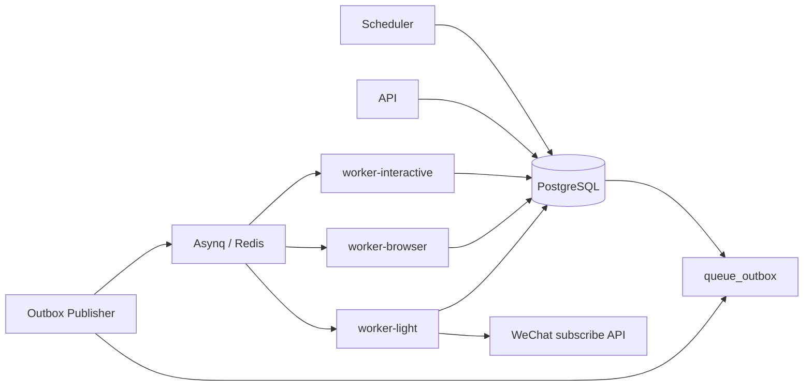
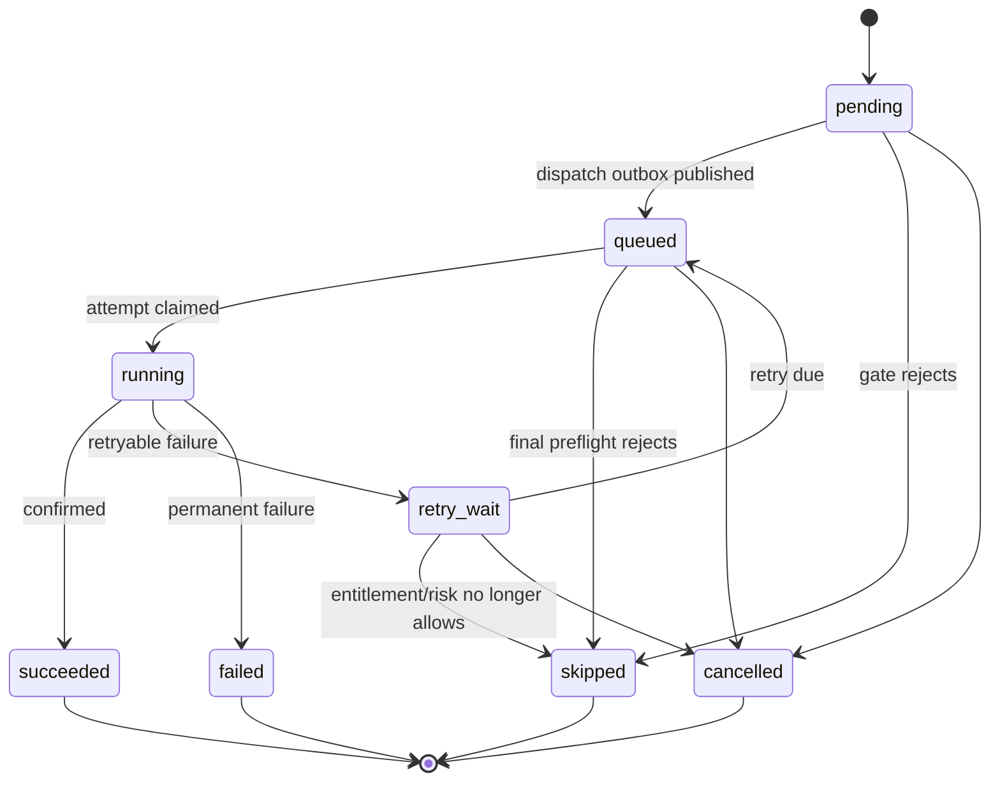
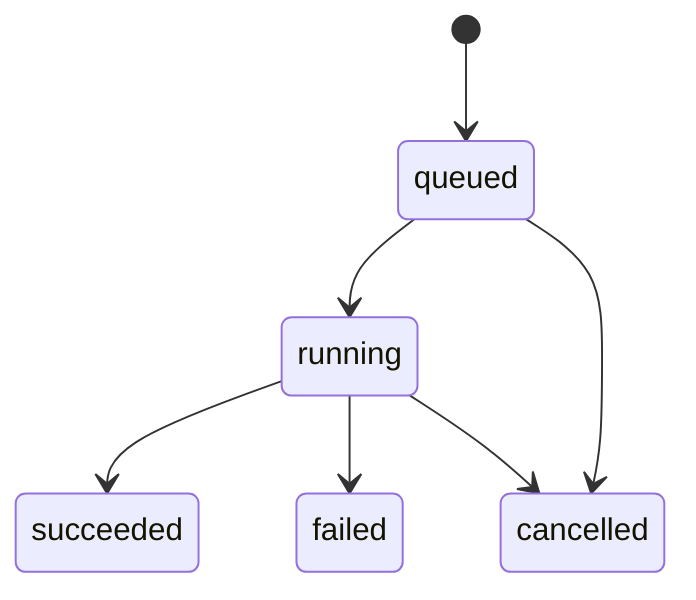
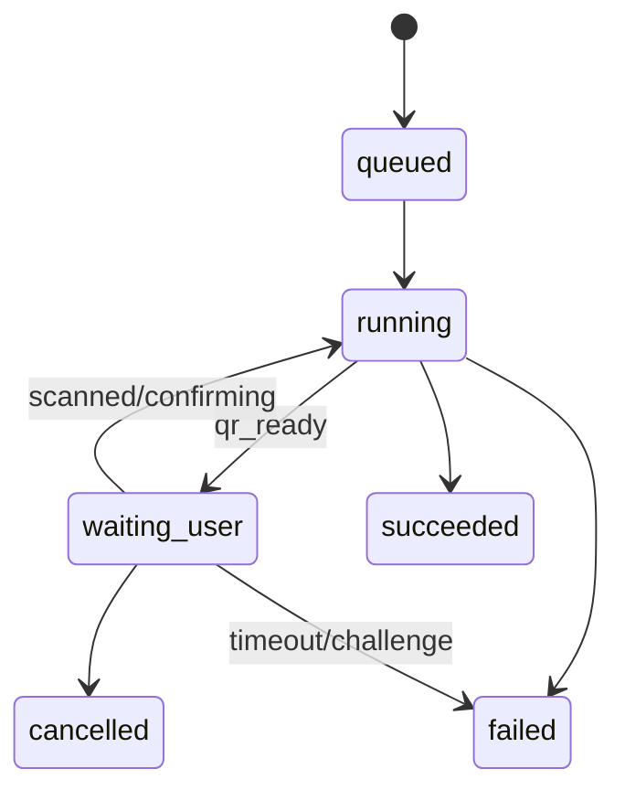

# Scheduler / Worker 状态机设计

> 本文冻结“什么时候产生自动发送、如何可靠入队、Worker 如何抢占执行、失败如何重试、崩溃如何恢复”。核心原则：数据库状态是真相，Redis/Asynq 是传输层，不是业务状态源。

## 1. 组件



职责：

- Scheduler：决定“应该发生什么”；
- Outbox Publisher：决定“如何可靠投递”；
- Worker：决定“如何执行”；
- PostgreSQL：持久化业务状态；
- Redis/Asynq：只负责 transport / delay / queue。

风险通知同事务写入 `notification_deliveries` 和
`queue_outbox(kind=notification.wechat.send)`。`worker-light` 只从 outbox stable id
加载通知，已发送/已跳过的 delivery 直接幂等 ACK；微信临时失败写入 `failed` 后返回
错误，交给 Asynq 重试。

权益到期提醒是 Scheduler 的独立站内通知扫描：每 60 秒以有界批次查询当前已生效且
7 天内到期的 Grant，只在剩余 7 天、3 天或 1 天时生成通知。其 dedupe key 包含 Grant
和阈值，数据库唯一约束保证重复扫描幂等；该类型不创建微信 delivery 或 outbox。

## 1.1 Container Mapping

逻辑组件与 Docker 镜像不是一一对应。生产部署中：

```text
scheduler
worker-interactive
worker-browser
worker-light
```

四个 Compose service 复用同一个 `keeper-worker` 镜像，仅使用不同启动命令。这样状态机和资源池仍隔离，但发布物只有一套 Worker runtime。详细见 `16-deployment-packaging.md`。

## 2. Transactional Outbox

### 2.1 为什么使用

禁止：

```text
BEGIN DB
INSERT intent
COMMIT

enqueue Redis  <-- 此处崩溃会丢任务
```

改为：

```text
BEGIN
  INSERT intent/job
  INSERT queue_outbox
COMMIT
```

Outbox Publisher 再异步把待投递记录写入 Asynq。

DB 与 Queue 不需要分布式事务。

### 2.2 queue_outbox

建议字段：

```text
id
public_id
kind
aggregate_type
aggregate_id
payload_json
status            pending | publishing | published | dead
available_at
attempts
next_attempt_at
dedupe_key
locked_by
locked_until
last_error_code
created_at
published_at
```

唯一：

```text
UNIQUE(dedupe_key)
```

Publisher 使用：

```sql
SELECT ...
FROM queue_outbox
WHERE status = 'pending'
  AND available_at <= now()
  AND (next_attempt_at IS NULL OR next_attempt_at <= now())
ORDER BY id
FOR UPDATE SKIP LOCKED
LIMIT 100;
```

成功发布：`published`。

发布失败：增加 attempts + backoff；超过阈值进入 `dead` 并告警。

Asynq Task 本身仍可设置 Unique/Dedupe，作为第二道保险，但业务正确性不依赖它。

## 3. Scheduler Tick

建议每 30~60 秒 Tick，一次处理有限批次。

### 3.1 Due Task 判定

一个 SparkTask 可产生今日 Scheduled Intent，当：

```text
enabled
AND not deleted
AND now in task local schedule window
AND friend.identity_status = resolved
AND account bound
AND no blocking risk
AND session not known-expired
AND entitlement allows send.execute
AND no existing (task_id, local_date) intent
```

注意：Capability 可在真正执行前再判断。Scheduler 不应因为 Protocol 临时 degraded 而丢掉整日计划。

### 3.2 Intent 创建事务

对每个 Task：

```text
BEGIN
  INSERT SendIntent(task_id, local_date) ON CONFLICT DO NOTHING
  if not inserted -> COMMIT / done

  reserve Entitlement DailySendQuota
  if quota unavailable:
      mark intent skipped(DAILY_SEND_QUOTA_EXCEEDED)
      COMMIT
      done

  INSERT queue_outbox(kind=send.dispatch, dedupe=intent:{id}:dispatch)
COMMIT
```

更推荐先 reserve 再 insert 时对 unique conflict 释放 reservation；为减少补偿逻辑，可采用：

```text
lock entitlement_daily_usage row
check quota
insert intent ON CONFLICT DO NOTHING
if inserted -> increment reservation + outbox
```

同事务中完成。

## 4. SendIntent 状态机

建议正式增加 `retry_wait`：



Terminal：

```text
succeeded
failed
skipped
cancelled
```

`failed` 表示实际执行后得到永久失败；`skipped` 表示因为业务 Gate 没有进行平台动作。

## 5. SendJob Attempt

一个 Intent 可以有多个 Attempt：

```text
Intent #A
├─ SendJob attempt 1 -> NETWORK_TIMEOUT
├─ SendJob attempt 2 -> SIDECAR_EXITED
└─ SendJob attempt 3 -> succeeded
```

SendJob 状态：



字段建议：

```text
attempt
status
selected_adapter
worker_id
lease_expires_at
heartbeat_at
error_code
retryable
platform_message_id
started_at
finished_at
```

每个 Attempt 都持久化，方便定位 fallback/retry 行为。

## 6. Dispatch 流程

`send.dispatch` 是轻量任务，不直接访问平台。

事务：

```text
load Intent FOR UPDATE
if terminal -> ack
if not due -> create delayed outbox and ack

recheck entitlement
recheck account/session/risk
recheck friend stable identity

select preferred capability route
create SendJob(attempt = previous + 1, queued)
set Intent queued + last_job_id
create Outbox(send.browser | send.protocol, job_id)
commit
```

Browser Worker 开始执行前还要检查任务快照的 `allow_first_message`：若为 true，则当前
有效权益必须包含 `creator_first_message`；失败时不调用 Sidecar。

Adapter 选择只产生“计划路由”。真正 Worker 开始前仍做 capability health check。

当前 Browser Worker 的发送 preflight 会读取账号的
`message.send.text.existing` snapshot：只有状态为 `available` 才允许进入
Sidecar；snapshot 缺失、`degraded` 或 `unavailable` 时直接以
`ADAPTER_UNAVAILABLE`（或快照中的兼容性错误）结束，并释放已预占的日配额。
账号 `paused_at`、`risk_status=cooling_down/paused` 或有效 `cooldown_until` 同样
直接结束发送，不调用 Sidecar。
账号绑定成功后会通过 `capability.probe` 投递首次 `health.check`；Scheduler
随后每 10 分钟为过期 snapshot 投递刷新任务。全局 `adapter_health` 在连续 3 次
健康/兼容性失败后进入 `open` 10 分钟，open 期间发送 Worker 直接 fail closed，
成功探测或确认发送后恢复 healthy。由于 probe 和发送结果通过异步 Worker 回写，
健康记录按 `checked_at` 单调更新；旧结果不得覆盖更新的健康状态或重新打开已恢复的
Adapter。

## 7. Worker Claim

收到 queue task 后：

```text
1. parse stable job_id
2. load SendJob
3. terminal -> ACK
4. CAS queued -> running
5. set worker_id + lease_expires_at
6. acquire account lock
7. final preflight
8. execute adapter
9. persist result
10. release account lock
11. ACK queue message
```

`CAS queued -> running` 使 Redis 重复投递不会执行两次。

建议 SQL：

```sql
UPDATE send_jobs
SET status = 'running',
    worker_id = $worker,
    started_at = COALESCE(started_at, now()),
    heartbeat_at = now(),
    lease_expires_at = now() + interval '90 seconds'
WHERE id = $id
  AND status = 'queued'
RETURNING *;
```

未返回行则重新读取状态后 ACK/处理。

## 8. Account Lock

平台动作级锁：

```text
lock:account:{account_id}
```

Value 至少包含随机 owner token/job id。

获取：Redis `SET NX PX`。

续租：Lua compare-owner + PEXPIRE。

释放：Lua compare-owner + DEL。

禁止无条件 DEL。

### 锁粒度

必须锁：

- login/binding；
- browser friend sync；
- send；
- 会改变平台会话状态的操作。

可不锁：

- DB-only 查询；
- entitlement redeem；
- admin report；
- scheduler create intent。

## 9. Worker Lease 与崩溃恢复

Redis lock 解决账号并发，但不能替代 DB Job lease。

运行中 Worker 每 20~30 秒 heartbeat：

```text
heartbeat_at
lease_expires_at
```

当前 Send Worker 在 Claim 后每 20 秒更新一次 `send_jobs` lease；Repository 同时校验
`status='running'` 和 `worker_id`。最终 `FinishJob` 也只接受仍处于 `running` 的 Job，
避免 lease Reaper 先以 `OUTCOME_UNKNOWN` 关闭任务后，迟到的旧 Worker 再覆盖终态。
QR/SMS、Friends Sync 和 Session Check 的 Generic Job 同样在 Claim 后启动 20 秒
heartbeat；Generic Job 的终态写入只接受 `running/waiting_user`，因此 Reaper 关闭后的
迟到 Worker 不能覆盖 `OUTCOME_UNKNOWN`。

Scheduler/Reaper 查找：

```text
status IN (running, waiting_user)
AND lease_expires_at < now()
```

处理：

- 如果平台动作是否成功未知，不立即盲目重发；
- 优先进入 `OUTCOME_UNKNOWN` 内部错误分类；
- 若有平台 message id/归档查询能力，先 reconcile；
- 无法确认时默认 fail-closed，避免重复发送。

这是发送场景与普通 HTTP 重试最大的区别。

## 10. Retry Policy

自动重试只覆盖“可以确信上次没有成功产生平台副作用”的错误。

### 可重试

```text
NETWORK_CONNECT_FAILED
SIDECAR_START_FAILED
SIDECAR_EXITED_BEFORE_REQUEST
TEMPORARY_PLATFORM_5XX (明确无发送确认)
```

### 条件重试

```text
NETWORK_TIMEOUT
```

如果请求已经提交但响应丢失，结果可能未知，必须走 reconcile，而不是立即重发。

Go Worker 只接受 Sidecar `retryable=true` 且错误码属于安全白名单的响应：
`ADAPTER_UNAVAILABLE`（进程启动前失败）或 `NETWORK_TIMEOUT`（Adapter 明确确认请求未提交）。
写入/读取失败、响应丢失和平台结果未知一律 fail-closed。

### 不重试

```text
SESSION_EXPIRED
CHALLENGE_REQUIRED
PLATFORM_RATE_LIMITED
FRIEND_AMBIGUOUS
TARGET_IDENTITY_MISMATCH
ADAPTER_INCOMPATIBLE
BROWSER_SELECTOR_CHANGED
FEATURE_NOT_ENTITLED
ENTITLEMENT_EXPIRED
```

## 11. Retry Backoff

推荐显式策略，而不是完全依赖 Asynq 默认 retry：

```text
attempt 1: now
attempt 2: +30s
attempt 3: +2m
attempt 4: +10m
```

最大 Attempt 由 ErrorKind 决定。

MVP 对上述安全重试错误统一最多执行 4 个 Attempt；达到上限后终止 Intent 并结算预留配额。

重试流程：

```text
SendJob failed(retryable)
  ↓
Intent retry_wait
  ↓ next_attempt_at
Scheduler retry scan
  ↓
Outbox send.dispatch
```

每次重试创建新 SendJob，不复用旧 Attempt。

## 12. Adapter Fallback

Fallback 与 Retry 不同。

例如：

```text
protocol attempt -> ADAPTER_INCOMPATIBLE
```

若 Browser capability 可用且错误确认“未发送”，可以在同一个 Intent 下创建下一 SendJob：

```text
attempt 1 protocol failed
attempt 2 browser queued
```

`ADAPTER_INCOMPATIBLE` 同时更新全局 AdapterHealth/Circuit Breaker，避免每个账号重复撞失败。

Sidecar failure 的 `error.detail` 必须携带明确且相互一致的发送结果证据；`outcome=unknown`、缺失
证据、`outcome` 与 `platform_write_accepted` 冲突以及 NDJSON 读写中断都保持 fail-closed，
不得因为错误码相似而自动回落或重发。

如果结果未知，不允许 fallback 重发。

当前 worker registry 已由 `worker-light` 接收 `send.protocol` 并执行统一 preflight；
但 `protocol.im` 仍要求有效的协议能力快照和真实 SDK，缺失时由显式 unavailable client
直接失败；首聊计划不会误调用 Browser Sidecar，也不会由 stub handler ACK。协议适配器返回失败后，只有 `error.detail.outcome=not_sent`（或明确的
`platform_write_accepted=false`）才可创建 attempt 2 browser。当前实现会在同一事务中将
Protocol attempt 标记失败、创建 `selected_adapter=browser.consumer` 的新 queued Job，并
写入 `send.browser` outbox；未知结果、首聊任务、Browser capability 不可用或 Browser
health 被禁用/熔断时均不创建 fallback。
Worker 对未配置或误投递的 outbox kind 返回错误，不以 stub 成功 ACK。

## 13. Generic Job 状态机

QR Login/Friends Sync/Session Check 使用 `jobs`。

建议状态扩充为：

```text
queued
running
waiting_user
succeeded
failed
cancelled
```

QR：



`waiting_user` 仍持有 Interactive Worker 和 Account Lock，但必须有硬超时。

## 14. Cancellation

不要直接由 API 把 running Job 改成 cancelled。

API：

```text
POST /jobs/{id}/cancel
```

事务只设置：

```text
cancel_requested_at = now()
```

Worker：

- claim 后、平台调用前，以及长轮询/同步落库前重新读取 `cancel_requested_at`；
- Sidecar 支持 cancel 时发 cancel；
- 清理临时文件/profile；
- 最终写 `cancelled`。

如果已经产生平台成功结果，则不能“取消成功”，应保留 succeeded。

## 15. Entitlement 双检查

创建 Intent 时检查一次：

```text
scheduler/API gate
```

真正执行前再检查一次：

```text
worker preflight
```

这样可以处理：

- 卡密在排队期间到期；
- Admin revoke；
- Feature 被禁用。

第二次失败：

```text
Intent -> skipped
SendJob -> cancelled/failed-preflight（实现上建议 cancelled + error_code）
release daily quota reservation
```

不调用 Sidecar。

## 16. Risk 处理

Worker 统一把 Sidecar/Platform error 分类成：

```text
AUTH
PLATFORM
PROTOCOL
BROWSER
NETWORK
DATA
```

示例 Policy：

```text
SESSION_EXPIRED
→ account.session_status=expired
→ stop future send

CHALLENGE_REQUIRED
→ account.session_status=challenge_required
→ user intervention

PLATFORM_RATE_LIMITED
→ risk cooldown
→ no automatic immediate retry

ADAPTER_INCOMPATIBLE
→ global adapter circuit open
→ do not expire account session

TARGET_IDENTITY_MISMATCH
→ friend/conversation data issue
→ fail closed
```

## 17. Browser Semaphore

`worker-browser` 除 queue concurrency 外再使用全局 Browser Semaphore：

```text
semaphore:browser
```

当前实现使用 Redis Sorted Set token semaphore：key 为 `semaphore:browser`，每个槽位
是带 TTL 的租约，Sidecar 调用期间自动续租，结束后按 owner token 释放；租约过期时由
下一次 acquire 原子清理。这样多个 `worker-browser` 进程共享同一容量上限。

如果部署多个 browser worker，必须使用全局 semaphore 或按每实例容量精确分配。

推荐先配置：

```text
WORKER_BROWSER_CONCURRENCY
MAX_GLOBAL_BROWSERS
BROWSER_SEMAPHORE_TTL
```

前者是单进程 queue concurrency，后两者控制全局租约；默认值分别为 `3`、`3` 和 `2m`。
`worker-light` 的 Protocol Sidecar 不占用 Browser Semaphore。

## 18. Queue 拆分

建议：

```text
interactive
browser
light
```

任务：

```text
interactive:
  account.bind.qr
  account.bind.sms.*

browser:
  account.session_check.browser
  account.friends_sync.browser
  send.browser

light:
  send.dispatch
  send.protocol
  capability.probe
```

Scheduler 不跑在 Asynq Queue 中，而是独立进程/leader tick。

## 19. Scheduler Leader

即使 MVP 只运行一个 scheduler，也使用 Redis leader lease：

```text
lock:scheduler:leader
```

多个实例时只有 leader 做 Tick/Reaper/Retry Scan。

Outbox Publisher 可多实例并发，通过 PostgreSQL `SKIP LOCKED` 自然分片，不一定需要 leader。

## 20. Reconciler / Maintenance

Scheduler 周期任务：

### Outbox Recovery

- publishing lock expired -> pending；
- dead -> alert/admin inspect。

### Send Retry Scan

- `retry_wait AND next_attempt_at <= now` -> outbox `send.dispatch`。

### Worker Lease Reaper

- running lease expired -> outcome reconcile / fail closed。
- Generic Job 的 `running/waiting_user` lease 过期后写入 `OUTCOME_UNKNOWN` 并追加 `error`
  事件；若 API 已请求取消，则最终写 `cancelled` 和 `cancelled` 事件。
- `account.bind.qr` / `account.bind.sms` 超时回收时，若账号仍为 `binding`，恢复为
  `unbound`，避免账号配额永久被占用。

### Binding Cleanup

- 超时 binding Account；
- 临时 Login Profile cleanup；
- pending job timeout。

### Risk Expiry

- cooldown_until passed -> normal；
- 不自动改变 session_status。

### Session Health Check

- 每 60 秒以有界批次扫描账号，但以 30 分钟为 Session 检查周期；
- 仅选择 `binding_status=bound` 且 `session_status IN (unknown, valid)`、
  `last_session_check_at` 已过期的账号；
- 排除已有 queued/running/waiting_user 检查 Job 或周期内刚创建的检查 Job；
- 在同一事务中创建 `jobs(account.session_check.browser)` 与对应 outbox，Worker
  完成后更新 Session 检查时间；
- `SESSION_EXPIRED` / `CHALLENGE_REQUIRED` 仍由 Risk Service 记录事件、更新状态并
  通过站内通知提醒账号所有者，Scheduler 不重复探测已进入人工处理状态的账号。

当前 Scheduler 每 60 秒以有界批次执行上述清理，并将变更持久化到
`douyin_accounts`；Worker 记录风险事件与账号动作使用同一事务，避免只改状态而丢失审计事件。

## 21. 发送成功定义

只在 Adapter 返回可验证的成功证据时：

```text
platform_message_id
OR adapter-confirmed receipt
```

才进入：

```text
SendJob succeeded
SendIntent succeeded
Friend.last_sent_at = now
DailyUsage succeeded_send_count + 1
```

“Sidecar 没报错”“sleep 一段时间”“页面按钮点了”都不是成功确认。

## 22. 关键不变量

实现和测试必须保证：

1. 同一 Scheduled Task 同一天最多一个 Intent；
2. 同一 Idempotency-Key 最多一个 Manual Intent；
3. 一个 Intent 同一时刻最多一个 running SendJob；
4. 同一 Account 同一时刻最多一个平台写操作；
5. Redis 重复投递不会重复执行已 terminal Job；
6. Outbox 发布失败不会丢业务 Job；
7. Worker crash 后不会直接盲目重发结果未知的消息；
8. Entitlement 到期/撤销后，不再产生新的平台动作；
9. Protocol failure 不把 Session 标记 expired；
10. Friend stable identity 不明确时绝不发送。
