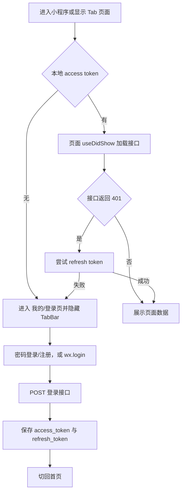
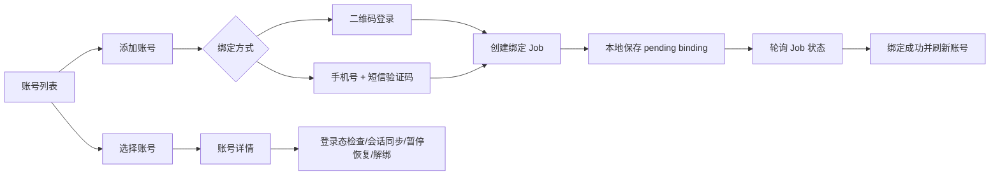

# 微信小程序流程梳理

本文以 `apps/mini` 当前实现为准，记录页面入口、登录态、接口调用、异步 Job 和页面之间的跳转关系。小程序是移动控制台，业务数据的唯一来源是 Go API，微信本地存储只保存登录会话和未完成的绑定任务。

## 1. 页面与导航

`app.config.ts` 注册了 6 个页面，其中 5 个页面属于 TabBar：

| 页面 | TabBar 文案 | 作用 |
| --- | --- | --- |
| `pages/index/index` | 首页 | 当前账号、今日概览、风险、最近发送记录和快捷操作 |
| `pages/spark/index` | 会话 | 按账号查看会话，开关火花维护，编辑已有任务，归档/恢复会话 |
| `pages/tasks/index` | 任务 | 创建、编辑、启停、删除和立即执行火花任务 |
| `pages/accounts/index` | 账号 | 账号列表、绑定流程、登录态检查、会话同步、暂停/恢复和解绑 |
| `pages/login/index` | 我的 | 登录/注册、权益、兑换记录、站内通知、微信通知、帮助和退出 |
| `pages/history/index` | 无 | 从首页或任务详情进入的发送记录页，按日期和状态筛选 |

页面内部采用本地 `screen` 状态承载详情和抽屉，不额外增加路由：账号页包含绑定流程和账号详情，任务页包含详情/编辑/执行记录/模板，`我的`页包含权益、记录、通知和设置。

## 2. 全局登录流程



所有小程序接口都经过 `src/lib/api.ts` 的统一请求函数：自动补充 Bearer token、处理 JSON 错误、遇到 401 时刷新会话；刷新失败会清除本地会话。页面对登录过期、空数据、加载中和接口错误分别展示可恢复状态。

## 3. 首页流程

首页已切换为真实接口，不再使用设计稿演示数据。进入首页后并行读取：

| 接口 | 用途 |
| --- | --- |
| `GET /me` | 当前用户显示名 |
| `GET /accounts` | 账号状态、头像、好友数、启用任务数和今日发送计数 |
| `GET /tasks` | 计算启用任务数和当前账号下一项可执行任务 |
| `GET /send-intents?from=&to=` | 读取 `Asia/Shanghai` 当日的待处理、成功、失败和最近记录 |
| `GET /notifications?limit=3` | 消息铃铛未读数；通知失败不阻断首页主体数据 |

首页数据映射如下：

- 账号卡显示绑定状态、Session 状态、风险状态、好友数和启用任务数。
- 今日概览由真实任务与当日 `send_intents` 聚合，不再展示固定数字。
- 风险提醒由账号的 Session 异常、风险冷却状态生成，点击进入账号页。
- 最近任务来自当日发送记录，时间按产品时区格式化。
- 消息铃铛跳转“我的 → 通知设置”。

首页快捷入口对应以下真实操作：

| 入口 | 请求 | 后续处理 |
| --- | --- | --- |
| 同步会话 | `POST /accounts/{id}/conversations-sync` | 创建 Job，轮询 `GET /jobs/{id}`，完成后刷新首页 |
| 立即执行 | `POST /tasks/{id}/run-now` | 使用一次性幂等键，轮询 `GET /send-jobs/{id}` |
| 任务列表 | 切换到 `pages/tasks/index` | 由任务页继续管理 |
| 账号状态 | `POST /accounts/{id}/session-check` | 创建 Job，轮询 `GET /jobs/{id}`，完成后刷新首页 |

首页所有写操作都在服务端成功后才改变界面状态；重复提交由 `Idempotency-Key` 防护，Job 失败会保留错误信息并允许重试。

## 4. 账号流程



账号页的关键接口包括：

- `GET /accounts`、`GET /me/entitlement`：列表和账号额度。
- `POST /accounts/bindings`：二维码或短信绑定，响应 Job ID。
- `GET /jobs/{id}`、`POST /jobs/{id}/sms-verify`：恢复和推进绑定任务。
- `POST /accounts/{id}/session-check`、`POST /accounts/{id}/conversations-sync`：登录态检查和会话同步。
- `GET /accounts/{id}/capabilities`、`POST /accounts/{id}/pause`、`POST /accounts/{id}/resume`、`DELETE /accounts/{id}`：能力、暂停、恢复和解绑。

绑定任务写入本地 `pending-binding`，因此小程序被隐藏或重新进入后仍能恢复进度。会话同步虽然保留了 `listFriends` 的兼容函数名，实际请求的是统一的会话接口；产品对象是会话，不是独立好友列表。

## 5. 会话页流程

会话页先加载账号，再按当前账号加载会话和任务：

1. `GET /accounts`，选择当前账号。
2. `GET /accounts/{id}/conversations`，支持未归档/已归档筛选。
3. `GET /tasks`、`GET /message-templates`，关联已有维护任务。
4. 对已解析目标执行 `PATCH /friends/{id}` 开关维护，服务端成功后更新 UI。
5. 编辑已有任务使用 `PATCH /tasks/{id}`，不会因打开页面而隐式创建任务。
6. 普通归档使用 `PATCH /accounts/{id}/conversations/{conversationId}`；平台归档提交 Job 后只展示排队结果，完成由 Job 状态确认。

## 6. 任务页流程

任务页加载账号、任务、模板和各账号会话索引，随后提供：

- 创建：`POST /tasks`。
- 编辑：`PATCH /tasks/{id}`。
- 启停：`PATCH /tasks/{id}`，只改变 `enabled`。
- 删除：`DELETE /tasks/{id}`。
- 立即执行：`POST /tasks/{id}/run-now`，随后轮询 `GET /send-jobs/{id}`。
- 执行记录：`GET /send-intents?task_id={id}`。
- 模板 CRUD：`GET/POST/PATCH/DELETE /message-templates`。

时间窗口和权益由后端最终校验；前端只提供即时反馈，不把“提交成功”提前显示为“发送成功”。

## 7. 记录页流程

记录页进入时读取当前产品日（`Asia/Shanghai`），调用 `GET /send-intents` 并带上日期范围。日期或状态筛选变化时重新从第一页加载。状态在移动端归并为：

- `pending / queued / running / retry_wait` → 处理中；
- `succeeded` → 成功；
- `failed` → 失败；
- `skipped / cancelled` → 跳过/取消。

页面展示账号、会话、任务摘要、通道、执行时间和用户可读错误，不展示平台消息 ID 或敏感会话信息。

## 8. 我的与通知流程

未登录时显示 onboarding 和登录/注册；登录成功后进入资料概览。登录后的资料加载并行读取：

- `GET /me`；
- `GET /me/entitlement`；
- `GET /entitlements/redemptions`；
- `GET /notifications/preferences`；
- `GET /notifications`。

权益页通过 `POST /entitlements/redeem` 兑换卡密，成功后刷新权益与兑换记录。通知页支持分页、单条已读、全部已读，以及通过 `wx.requestSubscribeMessage` 授权后 `PATCH /notifications/preferences`。退出时调用 `POST /auth/logout` 并清除本地会话。

## 9. 当前完整链路

```text
登录
  → 首页读取用户/账号/任务/当日发送/通知
  → 账号页绑定抖音账号
  → Job 完成后刷新账号
  → 会话同步建立会话索引
  → 会话页开关火花或任务页创建任务
  → 调度器创建 SendIntent / SendJob
  → 首页、任务页和记录页读取执行状态
  → 异常进入账号风险状态或站内通知
  → 首页铃铛进入通知处理
```

需要注意的产品边界：小程序负责查看状态和发起受控操作；真实平台登录、会话同步和发送均由后端 Job/Worker 完成，前端不能把按钮点击直接当作平台成功。
